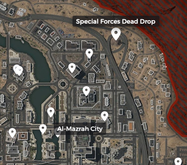

# DMZKey.com

## Keys:

### North West Sector

	
<b>1. Crane Control Room Key</b>
	

		<b>How to Get Key:</b> AI Drop, HVT, Loot  
		<b>Loot Location:</b> Bottom right of grid B3. This will be the grey door leading into the crane.  
		<b>Map:</b> 
		
		<b>Photo:</b> 
		
		

	
<b>2. Quarry Worker's Lost Toolbox Key</b>
	

		<b>How to Get Key:</b> AI Drop, HVT, Loot  
		<b>Loot Location:</b> Top right of grid B4. Can be found by diving into the water between the warehouses and checking underwater.  
		<b>Map:</b> 
		
		<b>Photo:</b> 
		

	
<b>3. Kushaak Construction Warehouse Key</b>
	

		<b>How to Get Key:</b> Convenience White Lotus Faction Mission, AI Drop, HVT, Loot 
		<b>Loot Location:</b> Found at the 2nd Floor of the Kushaak Warehouse. This structure is in the middle of the Al-Safwa Quarry. 
		<b>Map:</b> 
		
		<b>Photo:</b> 
		

	
<b>4. Al-Safwa Stone Block Office Key</b>
	

		<b>How to Get Key:</b> AI Drop, HVT, Loot  
		<b>Loot Location:</b> Middle left of grid C4. The locked room can be found in a rectangular building by the intersection, to the southeast of Al-Safwa Quarry. 
		<b>Map:</b> 
		
		<b>Photo:</b> 
		

	
<b>5. Rohan Oil Control Room Locker Key</b>
	

		<b>How to Get Key:</b> AI Drop, HVT, Loot  
		<b>Loot Location:</b> Look for a hut with a Control Room sign and enter it - you'll find a staircase leading to an underground complex where a locked locker will be along the hallway. 
		<b>Map:</b> 
		
		<b>Photo:</b> 
		

	
<b>6. Rohan Oil North Guard Shack Key</b>
	

		<b>How to Get Key:</b> AI Drop, HVT, Loot  
		<b>Loot Location:</b> Top middle of grid D3. It will be the 2nd building from the right (map view) on the norther edge of Rohan Oil. 
		<b>Map:</b> 
		
		<b>Photo:</b> 
		

	
<b>7. Rohan Oil South Guard Shack Key</b>
	

		<b>How to Get Key:</b> AI Drop, HVT, Loot  
		<b>Loot Location:</b> Bottom right of grid D3. This is lone guard shack south of the easternmost oil tanks in Rohan Oil. 
		<b>Map:</b> 
		
		<b>Photo:</b> 
		

	
<b>8. Taraq Smugglers Office Key</b>
	

		<b>How to Get Key:</b> AI Drop, HVT, Loot  
		<b>Loot Location:</b> Bottom right of grid D3. This is lone guard shack south of the easternmost oil tanks in Rohan Oil. 
		<b>Map:</b> 
		
		<b>Photo:</b> 
		

	
<b>9. Taraq River Supply Shack Key</b>
	

		<b>How to Get Key:</b> AI Drop, HVT, Loot  
		<b>Loot Location:</b> Top right of grid E2. Can be found inside a shack by the river (north of the small bridge). 
		<b>Map:</b> 
		
		<b>Photo:</b> 
		

### North East Sector

	
<b>1. Ch 7 Editorial Department Key</b>
	

		<b>How to Get Key:</b> AI Drop, HVT, Loot  
		<b>Loot Location:</b> Top Floor (11th) Editorial Department Room 
		<b>Map:</b> 
		 		
		<b>Photo:</b> 
		

	
<b>2. Ch 7 Secure Records Room Key</b>
	

		<b>How to Get Key:</b> AI Drop, HVT, Loot  
		<b>Loot Location:</b> 
		North East of the Main CH 7 building.
		 
		<b>Map:</b> 
		 
		<b>Photo:</b> 
		

	
<b>3. Special Forces Dead Drop Key</b>
	

		<b>How to Get Key:</b> AI Drop, HVT, Loot  
		<b>Loot Location:</b> 
		Climb on top of the outcrop, locked loot will be under the radio tower.
		 
		<b>Map:</b> 
		 
		 <b>Photo:</b> 
		

	
<b>4. US Embassy Key</b>
	

		<b>How to Get Key:</b> AI Drop, HVT, Loot  
		<b>Loot Location:</b> 
		Location should be marked on your Tac-Map with a US Embassy icon.
		 
		<b>Map:</b> 
		 
		<b>Photo:</b> 
		

	
<b>5. Canal Apartment 103 Key</b>
	

		<b>How to Get Key:</b> AI Drop, HVT, Loot  
		<b>Loot Location:</b> 
		First Floor - Room 103
		 
		<b>Map:</b> 
		 
		<b>Photo:</b> 
		

	
<b>6. North Canals Info Booth Key</b>
	

		<b>How to Get Key:</b> AI Drop, HVT, Loot  
		<b>Loot Location:</b> 
		South of Canal Apartment 10, beside the river you will see a small info booth.
		 
		<b>Map:</b> 
		 
		<b>Photo:</b> 
		

	
<b>7. Algae Covered Toolbox Key</b>
	

		<b>How to Get Key:</b> AI Drop, HVT, Loot  
		<b>Loot Location:</b> 
		Dive into the River Canal. Loot will be located underwater.
		 
		<b>Map:</b> 
		
		<b>Photo:</b> 
		

	
<b>8. Yum Yum Burger Back Room Key</b>
	

		<b>How to Get Key:</b> AI Drop, HVT, Loot  
		<b>Loot Location:</b> 
		Loot is located at the restaurant's Back Room Storage behind the cashier's counter.
		 
		<b>Map:</b> 
		
		<b>Photo:</b> 
		

	
<b>9. Downtown Post Office Key</b>
	

		<b>How to Get Key:</b> AI Drop, HVT, Loot  
		<b>Loot Location:</b> 
		Building will have a Mail icon on your map in Al-Mazrah City. The Post Office building will be covered in the AI enemy's flag.
		 
		<b>Map:</b> 
		
		<b>Photo:</b> 
		

	
<b>10. Police Academy Key</b>
	

		<b>How to Get Key:</b> AI Drop, HVT, Loot  
		<b>Loot Location:</b> 
		The Police Academy has a Police Badge icon on the map and the building will be covered by the AI enemy's flag as well.
		 
		<b>Map:</b> 
		
		<b>Photo:</b> 
		

	
<b>11. Police Academy Server Admin Key</b>
	

		<b>How to Get Key:</b> AI Drop, HVT, Loot  
		<b>Loot Location:</b> 
		Head to the building South East of Yum Yum Burger - Locked room will be located on the first floor.
		 
		<b>Map:</b> 
		
		<b>Photo:</b> 
		

	
<b>12. Police Academy Locker Room Key</b>
	

		<b>How to Get Key:</b> AI Drop, HVT, Loot  
		<b>Loot Location:</b> 
		Similar to the Server Admin Room, the locked room is also located on the first floor.
		 
		<b>Map:</b> 
		
		<b>Photo:</b> 
		

	
<b>13. Hydro Island Computer Key</b>
	

		<b>How to Get Key:</b> AI Drop, HVT, Loot  
		<b>Loot Location:</b> 
		Located at the backroom of the red building next to a pond.
		 
		<b>Map:</b> 
		
		<b>Photo:</b> 
		

	
<b>14. Mawizeh Cell Shop Key</b>
	

		<b>How to Get Key:</b> AI Drop, HVT, Loot  
		<b>Loot Location:</b> 
		Located West of the Marshlands - loot will be scattered on the floor inside the Cell Shop.
		 
		<b>Map:</b> 
		
		<b>Photo:</b> 
		

	
<b>15. Mawizeh Slum Discarded Cache Key</b>
	

		<b>How to Get Key:</b> AI Drop, HVT, Loot  
		<b>Loot Location:</b> 
		Located under the bridge, beside the destroyed vehicle.
		 
		<b>Map:</b> 
		
		<b>Photo:</b> 
		

	
<b>16. Mawizeh Power Control Key</b>
	

		<b>How to Get Key:</b> AI Drop, HVT, Loot  
		<b>Loot Location:</b> 
		Location will be a small booth just below the watertower.
		 
		<b>Map:</b> 
		
		<b>Photo:</b> 
		

	
<b>17. Under Freeway East Warehouse Key</b>
	

		<b>How to Get Key:</b> AI Drop, HVT, Loot  
		<b>Loot Location:</b> 
		Located along the highway south of the Police Academy.
		 
		<b>Map:</b> 
		
		<b>Photo:</b> 
		

	
<b>18. Ahmed Grocery Store Key</b>
	

		<b>How to Get Key:</b> AI Drop, HVT, Loot  
		<b>Loot Location:</b> 
		Store Office Room & Cache
		 
		<b>Map:</b> 
		
		<b>Photo:</b> 
		

	
<b>19. Far South Eastern Storage Closet Key</b>
	

		<b>How to Get Key:</b> AI Drop, HVT, Loot  
		<b>Loot Location:</b> 
		Duffel Bag Inside Storage Closet
		 
		<b>Map:</b> 
		
		<b>Photo:</b> 
		

### West Sector

	
<b>1. Hafid Ship First Mate Cache Key</b>
	

		<b>How to Get Key:</b> AI Drop, HVT, Loot  
		<b>Loot Location:</b>
		Top left of grid 6B. Can be found at the Ship Bridge Tower, one floor below the ship's bridge.
		 
		<b>Map:</b> 
		
		<b>Photo:</b> 
		

	
<b>2. Hafid Ship Bridge Cache Key</b>
	

		<b>How to Get Key:</b> AI Drop, HVT, Loot  
		<b>Loot Location:</b> 
		Top left of grid 6B. Can be found at the top floor of the Ship Bridge Tower.
		 
		<b>Map:</b> 
		
		<b>Photo:</b> 
		

	
<b>3. Longshoreman's Duffel Bag Key</b>
	

		<b>How to Get Key:</b> AI Drop, HVT, Loot  
		<b>Loot Location:</b> 
		Middle of grid 6B. Found on the concrete platform out at sea, south of the broken metal bridge.
		 
		<b>Map:</b> 
		
		<b>Photo:</b> 
		

	
<b>4. IHTAQ Warehouse Supply Room Key</b>
	

		<b>How to Get Key:</b> AI Drop, HVT, Loot  
		<b>Loot Location:</b> 
		Top left of grid C6. Found inside the largest Hafid Port warehouse (grey roof on map).
		 
		<b>Map:</b> 
		
		<b>Photo:</b> 
		

	
<b>5. Central Sa'id Top Floor Apartment Key</b>
	

		<b>How to Get Key:</b> AI Drop, HVT, Loot  
		<b>Loot Location:</b> 
		Bottom left of grid D4. Can be found inside the Sattiq Cave Complex. This is a restricted area so expect heavy resistance.
		 
		<b>Map:</b> 
		
		<b>Photo:</b> 
		

	
<b>6. Weapons Repair Kit Key</b>
	

		<b>How to Get Key:</b> AI Drop, HVT, Loot  
		<b>Loot Location:</b> 
		Duffel Bag Inside Storage Closet
		 
		<b>Map:</b> 
		
		<b>Photo:</b> 
		

	
<b>7. Cavern Boat Dock Shack Key</b>
	

		<b>How to Get Key:</b> AI Drop, HVT, Loot  
		<b>Loot Location:</b> 
		Head inside the Cavern located at the river bank. Inside you will find a shack at the end of the cavern. 	TBA
		 
		<b>Map:</b> 
		
		<b>Photo:</b> 
		

### Zaya Observatory and Mountains Key Locations Map

	
<b>1. Zaya Radar Dome Key </b>
	

		<b>How to Get Key:</b> AI Drop, HVT, Loot  
		<b>Loot Location:</b> 
		Northern part of the Observatory. Locked room will be under the big dome.
		 
		<b>Map:</b> 
		
		<b>Photo:</b> 
		

	
<b>2. Scientist's Locker Key</b>
	

		<b>How to Get Key:</b> AI Drop, HVT, Loot  
		<b>Loot Location:</b> 
		Head inside the bunker. Loot will be inside the locker along the corridor.
		 
		<b>Map:</b> 
		
		<b>Photo:</b> 
		

	
<b>3. Central Zaya Meeting Room Key</b>
	

		<b>How to Get Key:</b> AI Drop, HVT, Loot  
		<b>Loot Location:</b> 
		Room will be located inside the building at the center of the Observatory.
		 
		<b>Map:</b> 
		
		<b>Photo:</b> 
		

	
<b>4. South Zaya Scientist Apartment Key </b>
	

		<b>How to Get Key:</b> AI Drop, HVT, Loot  
		<b>Loot Location:</b> 
		2nd floor of the building on the Southern part of the Observatory.
		 
		<b>Map:</b> 
		
		<b>Photo:</b> 
		

	
<b>5. Mountaintop Spotter Shack Key</b>
	

		<b>How to Get Key:</b> AI Drop, HVT, Loot  
		<b>Loot Location:</b> 
		Top of Highest Mountain in Al Sharim
		 
		<b>Map:</b> 
		
		<b>Photo:</b> 
		

### South West Sector

	
<b>1. South Bank Apartment Key</b>
	

		<b>How to Get Key:</b> AI Drop, HVT, Loot  
		<b>Loot Location:</b> 
		Bottom of grid D6. Can be found on the 3rd floor of the apartment next to the hotel building (to the west of the hotel on the map).
		 
		<b>Map:</b> 
		
		<b>Photo:</b> 
		

	
<b>2. Power Substation Toolbox Key 	</b>
	

		<b>How to Get Key:</b> AI Drop, HVT, Loot  
		<b>Loot Location:</b> 
		Middle of grid D7. Toolbox can be found next to the large generator.
		 
		<b>Map:</b> 
		
		<b>Photo:</b> 
		

	
<b>3. Caretakers House Key</b>
	

		<b>How to Get Key:</b> AI Drop, HVT, Loot  
		<b>Loot Location:</b> 
		Bottom of grid D6. Can be found on the 3rd floor of the apartment next to the hotel building (to the west of the hotel on the map).
		 
		<b>Map:</b> 
		
		<b>Photo:</b> 
		

 

	
<b>4. Bank of Adal 2nd Story Office Key 	</b>
	

		<b>How to Get Key:</b> AI Drop, HVT, Loot  
		<b>Loot Location:</b> 
		Bottom left of grid D7 in Sawah Village. Head to the 2nd floor of the National Bank of Adal building (north west of the sunken plaza).
		 
		<b>Map:</b> 
		
		<b>Photo:</b> 
		

	
<b>5. Bank of Adal Top Story Office Key </b>
	

		<b>How to Get Key:</b> AI Drop, HVT, Loot  
		<b>Loot Location:</b> 
		Bottom of grid D6. Can be found on the 3rd floor of the apartment next to the hotel building (to the west of the hotel on the map).
		 
		<b>Map:</b> 
		
		<b>Photo:</b> 
		

	
<b>6. Sawah Hotel Room 302</b>
	

		<b>How to Get Key:</b> AI Drop, HVT, Loot  
		<b>Loot Location:</b> 
		Go up the 4th floor of the hotel. Room will be beside Hotel Room 303.
		 
		<b>Map:</b> 
		
		<b>Photo:</b> 
		

	
<b>7. Sawah Hotel Room 303 </b>
	

		<b>How to Get Key:</b> AI Drop, HVT, Loot  
		<b>Loot Location:</b> 
		Go up the 4th floor of the hotel. Room will be beside Hotel Room 302.		 
		<b>Map:</b> 
		
		<b>Photo:</b> 
		

	
<b>8. Captain’s Cache Key 	</b>
	

		<b>How to Get Key:</b> AI Drop, HVT, Loot  
		<b>Loot Location:</b> 
		Middle of grid E8. Can be found inside the partially sunk bridge of the ship.
		 
		<b>Map:</b> 
		
		<b>Photo:</b> 
		

	
<b>9. Deckhand’s Toolbox Key</b>
	

		<b>How to Get Key:</b> AI Drop, HVT, Loot  
		<b>Loot Location:</b> 
		Middle of grid E8. Can be found underwater. Swim down (facing the front of the bridge) and into the doorway leading to the toolbox.
		 
		<b>Map:</b> 
		

### South Sector

	
<b>1. Groundskeeping Building 	</b>
	

		<b>How to Get Key:</b> AI Drop, HVT, Loot  
		<b>Loot Location:</b> 
		Inside the Building with the Satellite Dish Antenna on the Roof
		 
		<b>Map:</b> 
		
		<b>Photo:</b> 
		

	
<b>2. Old Lighthouse Citadel Room 	</b>
	

		<b>How to Get Key:</b> AI Drop, HVT, Loot  
		<b>Loot Location:</b> 
		Inside Room on the Ground Floor of the Lighthouse
		 
		<b>Map:</b> 
		
		<b>Photo:</b> 
		

	
<b>3. Clock Repairs Tool</b>
	

		<b>How to Get Key:</b> AI Drop, HVT, Loot  
		<b>Loot Location:</b> 
		Located at the top of the tower.
		 
		<b>Map:</b> 
		
		<b>Photo:</b> 
		

	
<b>4. Al Bagra Munitions Storeroom 	</b>
	

		<b>How to Get Key:</b> AI Drop, HVT, Loot  
		<b>Loot Location:</b> 
		Underneath the South West building of the fortress. There will be two locked cell doors next to each other.
		 
		<b>Map:</b> 
		
		<b>Photo:</b> 
		

	
<b>5. A.B.F. Anitquities Office 	</b>
	

		<b>How to Get Key:</b> AI Drop, HVT, Loot  
		<b>Loot Location:</b> 
		2nd Floor of the Fortress's palace area. The palace is located on the Southern area with a statue present in it.
		 
		<b>Map:</b> 
		
		<b>Photo:</b> 
		

	
<b>6. Al Bagra Officers Quarters</b>
	

		<b>How to Get Key:</b> AI Drop, HVT, Loot  
		<b>Loot Location:</b> 
		Top Floor Eastern Wing of the Fortress
		 
		<b>Map:</b> 
		
		<b>Photo:</b> 
		

	
<b>7. Al Bagra Barrack 	</b>
	

		<b>How to Get Key:</b> AI Drop, HVT, Loot  
		<b>Loot Location:</b> 
		Underneath the Eastern building in a room with antiques present.
		 
		<b>Map:</b> 
		
		<b>Photo:</b> 
		

	
<b>8. South Al Bagra Top Floor Bedroom </b>
	

		<b>How to Get Key:</b> AI Drop, HVT, Loot  
		<b>Loot Location:</b> 
		Top floor of the building located on the Eastern outskirts of the Fortress.
		 
		<b>Map:</b> 
		
		<b>Photo:</b> 
		

	
<b>9. 	B.C. Toolbox</b>
	

		<b>How to Get Key:</b> AI Drop, HVT, Loot  
		<b>Loot Location:</b> 
		Located at the airport's baggage carousel maintenance area. Crawl through the baggage's entry chute (where baggages come out from)
		 
		<b>Map:</b> 
		
		<b>Photo:</b> 
		

	
<b>10. Traveler's Luggage 	</b>
	

		<b>How to Get Key:</b> AI Drop, HVT, Loot  
		<b>Loot Location:</b> 
		2nd Floor of the Southern area of the airport, sitting on the ground next to the row of seats.
		 
		<b>Map:</b> 
		
		<b>Photo:</b> 
		

	
<b>11. Airport Maintenance </b>
	

		<b>How to Get Key:</b> AI Drop, HVT, Loot  
		<b>Loot Location:</b> 
		Inside the Yum Yum Burger Restaurant. Located at the kitchen's back room storage
		 
		<b>Map:</b> 
		
		<b>Photo:</b> 
		

	